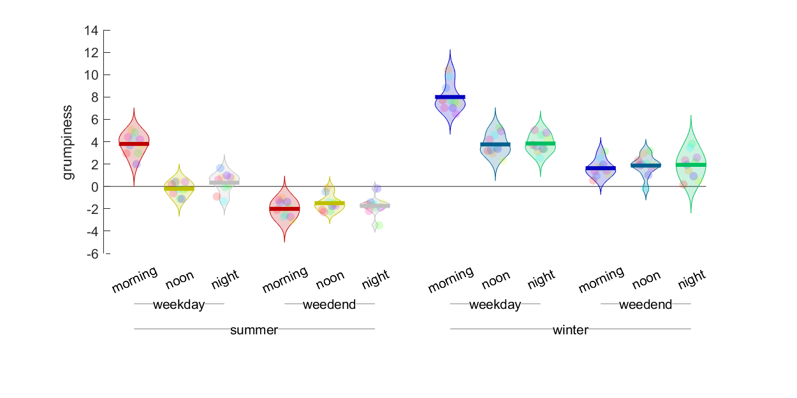
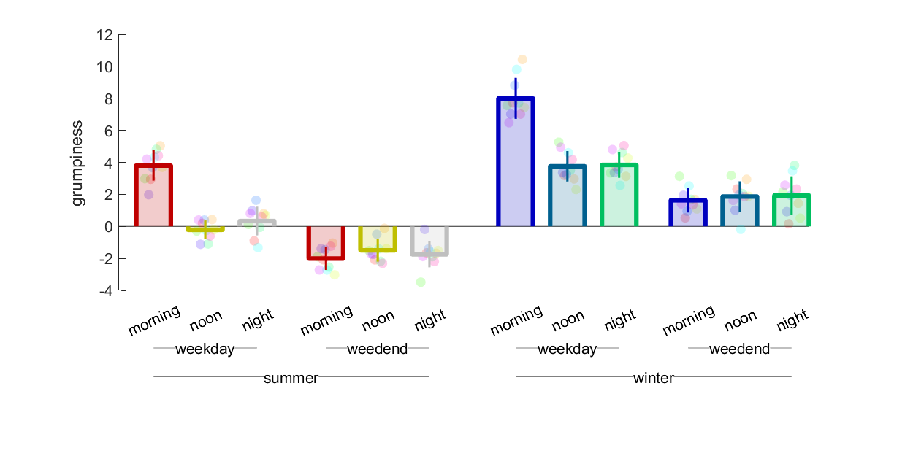
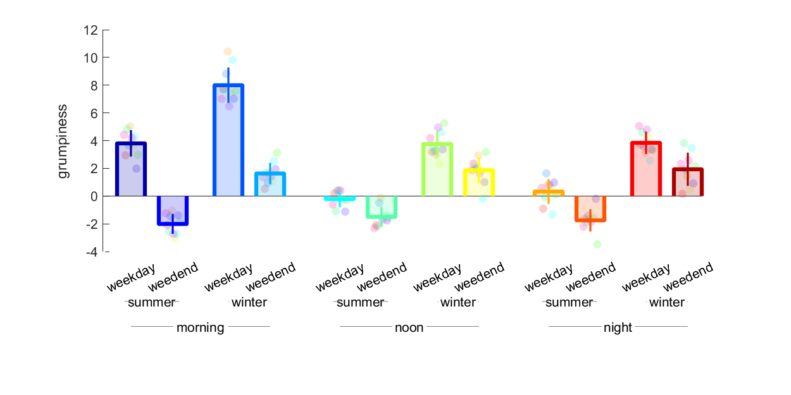
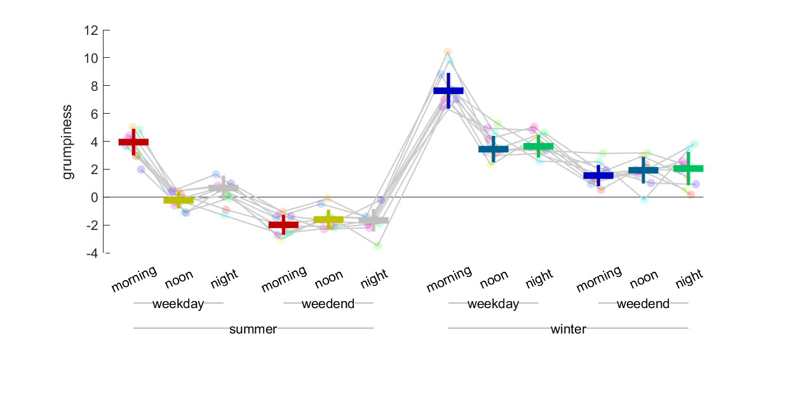
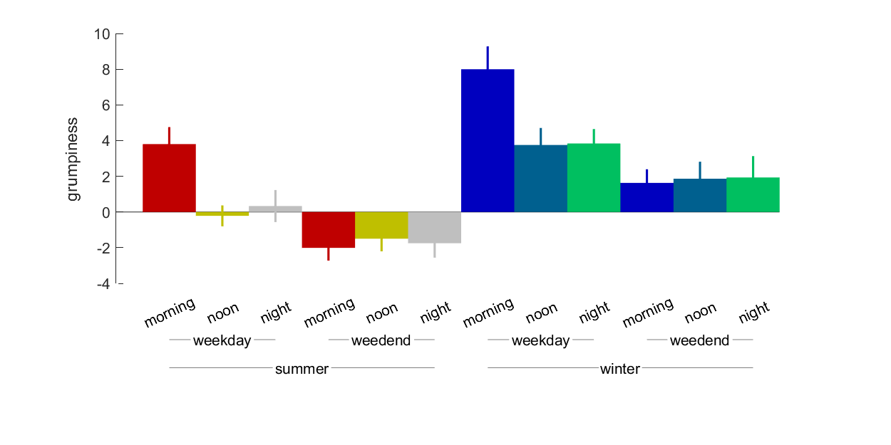

# make your plots more fancy
I'm sick and tired of plots that aren't fancy! `barFancy` allows you to make beautiful bar plots using simple data, as well as datasets with arbitrarily complex factor hierarchies.

Imagine you are trying to figure out when people are most grumpy. You guess that grumpiness varies with certain **factors**, such as the season, the day of the week, and the time of day. Each of these factors has multiple **levels** (summer/winter, weekday/weekend, morning/noon/night). With `barFancy` you can quickly generate bar plots that show the hierarchical relationships between your factors:




`barFancy` takes **requires only one input**: a *(number of factors) + 1* dimensional matrix, where each dimension is a factor, except the last dimension which contains data from all of your samples. There are tons of visualization options that can be passed as Name-Value pairs (see below).

## example
Let's start by generating some fake grumpiness data:
```Matlab
% model how gumpy people are in different seasons, days, and times
levels = {{'summer', 'winter'}, ...
           {'weekday', 'weedend'}, ...
           {'morning', 'noon', 'night'}};  % 3 factors with 2, 2, and 3 levels
samples = 10;  % number of samples in each condition

% generate 2 (season) X 2 (day) X 3 (time) X samples matrix
mood = normrnd(0, 1, [2,2,3,samples]);
mood(2,:,:,:) = mood(2,:,:,:)+4; % grumpy in the winter       :(
mood(:,1,1,:) = mood(:,1,1,:)+4; % grumpy weekday mornings    :(
mood(:,2,:,:) = mood(:,2,:,:)-2; % less grumpy on weekends    :)

% make kick ass color scheme
colors = [hot(3); hot(3); winter(3); winter(3)] * .75;
```

Let's check out the default plot:
```
% default settings
barFancy(mood, 'levelNames', levels, 'ylabel', 'grumpiness', 'colors', colors)
```



It's super trivial to reorder the factor hierarchy. Simply change the order of the dimensions in your matrix, and you're done!
```
% reshuffled factor hierarchy
moodShuffled = permute(mood, [3,1,2,4]);
levelsShuffled = levels([3,1,2]);
barFancy(moodShuffled, 'levelNames', levelsShuffled, 'ylabel', 'grumpiness', 'colors', 'jet')

```



There are tons of visualization options. Here are some examples of what you can play around with:
```
% violin plot
barFancy(mood, 'levelNames', levels, 'ylabel', 'grumpiness', 'colors', colors, ...
    'showBars', false', 'showViolins', true)
```


```
% plot with no bars, median instead of mean, and connected scatter points
barFancy(mood, 'levelNames', levels, 'ylabel', 'grumpiness', 'colors', colors, ...
    'showBars', false', 'summaryFunction', @median, 'connectDots', true)
```


```
% bar plot with solid bars, no scatter points, and no error bars
barFancy(mood, 'levelNames', levels, 'ylabel', 'grumpiness', 'colors', colors, ...
    'barAlpha', 1, 'showScatter', false)
```


## options
Here are the options that can be passed in as Name-Value pairs, along with their default values:
```
% bar settings
s.showBars = true;            % add vertical bars instead of just horizontal line at mean for each condition
s.barAlpha = .2;
s.showErrorBars = true;
s.summaryFunction = @nanmean; % statistic to use for bar height (can use median instead of mean, for example)
s.errorFunction = @nanstd;    % can change to custom error function, e.g. standard error instead of standard deviation
s.colors = [.2 .2 .2];        % bar colors // can be name of matlab color space (e.g. 'hsv') OR nX3 matrix of colors where each row is the color of a specific condition
s.showViolins = false;        % add vertical probability density estimates, creating a 'violin plot'
s.violinAlpha = .2;
s.barSeparation = 1;          % how far apart to separate bars // expressed as fraction of width of single bar
s.barWidth = 1;
s.lineThickness = 3;          % thickness of bar border

% scatter settings
s.connectDots = false;        % if samples are repeated measures (i.e. within subjects design), scatter points representing the same sample across conditions can be conneceted with lines
s.showScatter = true;         % scatter the values of individual samples
s.scatterColors = 'hsv';      % if single color, all scatters will have that colors // if a matlab color space (e.g. 'hsv') OR (number of samples per condition) X 3 matrix where each row is the color of a particular sample (appropriate for repeated measure designs)
s.scatterSize = 40;
s.scatterAlpha = .2;

% labels
s.levelNames = {};            % names of levels for each factor // cell array of cell arrays where each nested array contains names of the levels for a particular factor, e.g. {{'male', 'female'}, {'tall', 'short'}}
s.ylabel = [];
```
